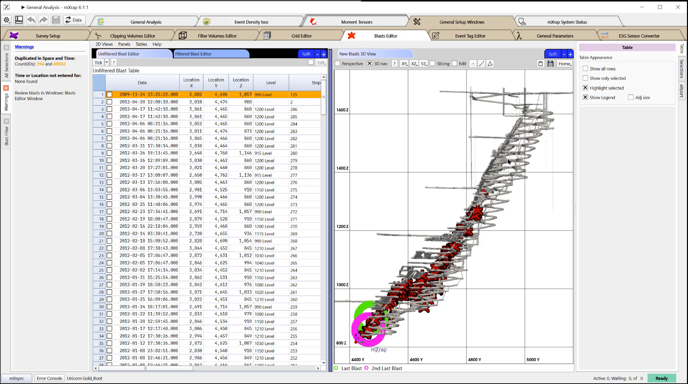
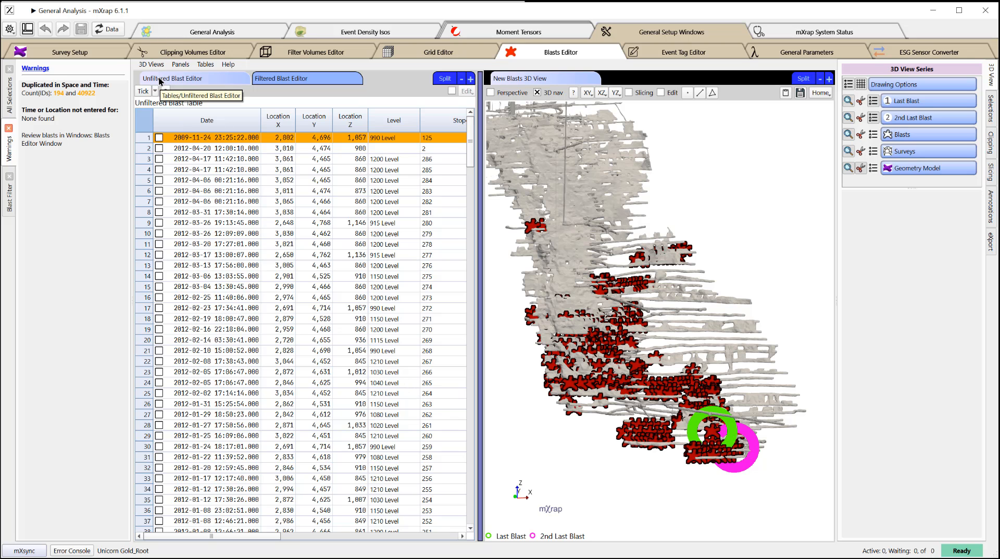
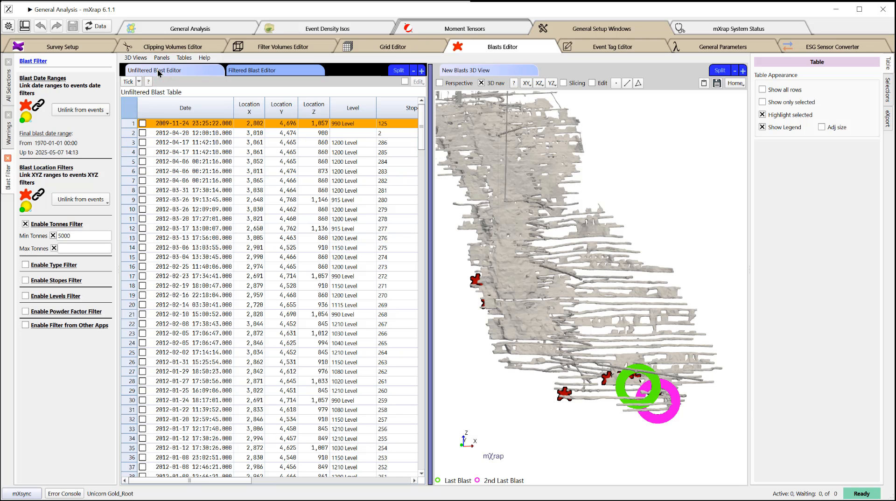
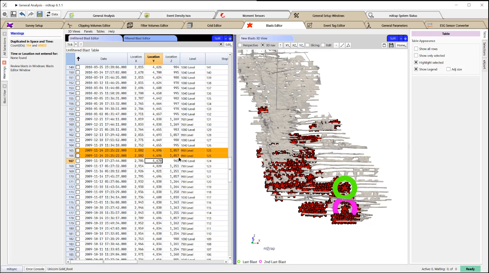
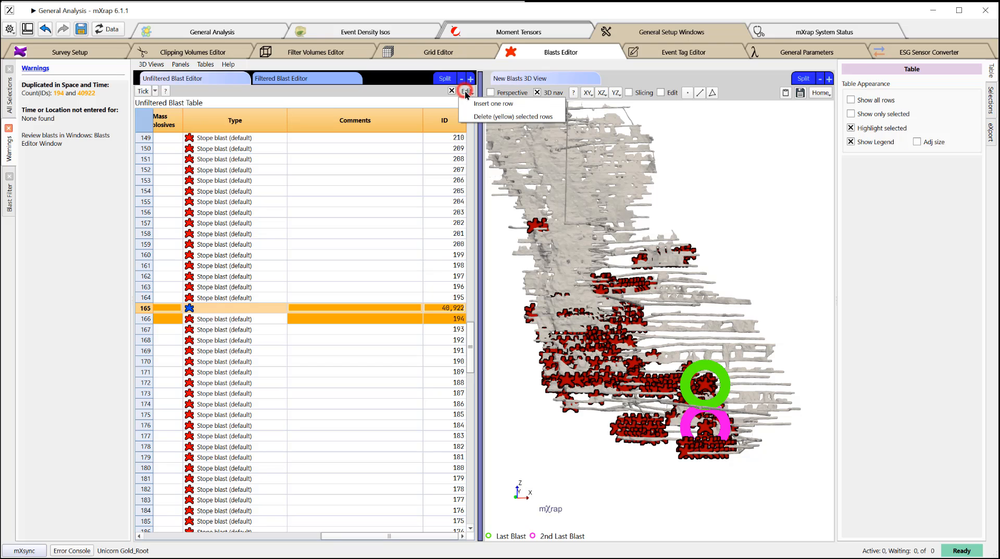
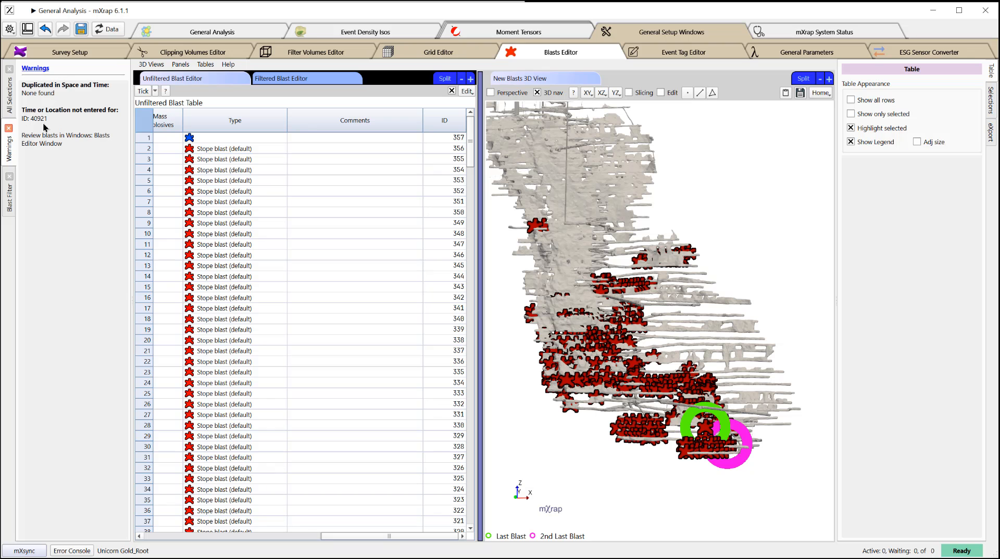
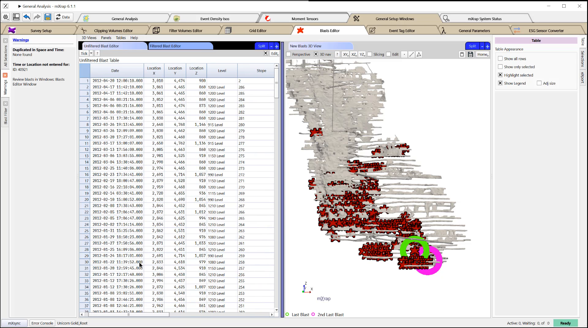
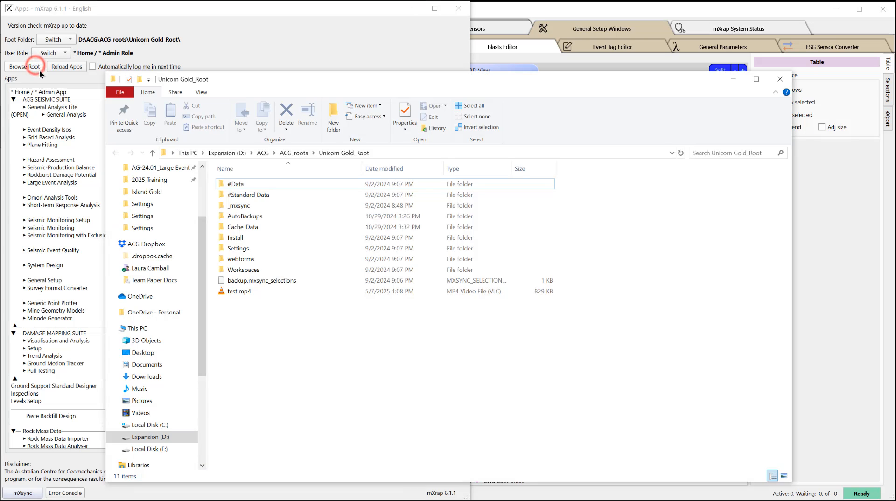
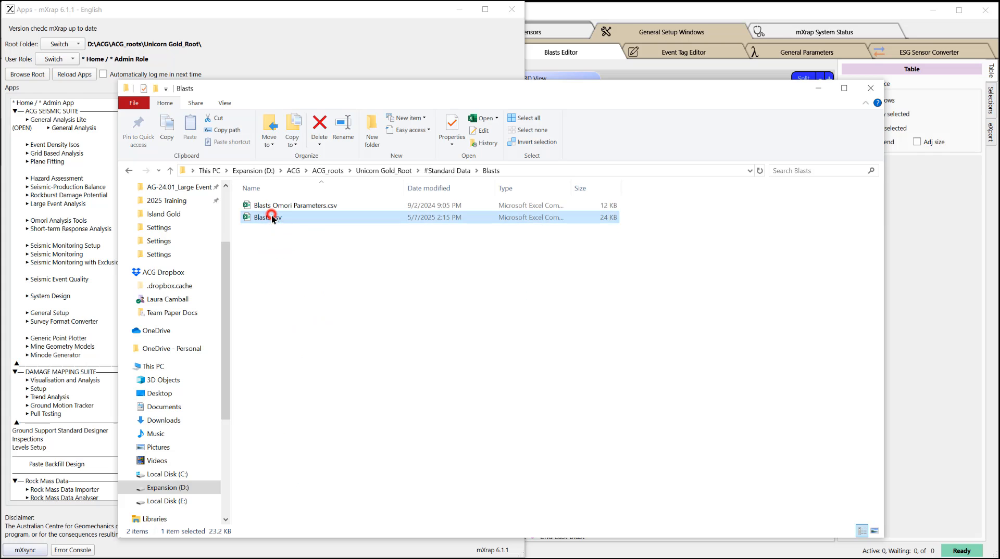
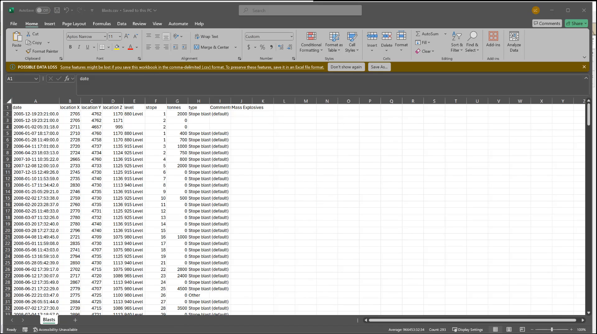

Laura here with the mXrap team.

This video covers the Blast Editor.

Today we're going to be looking at the
Blast Editor in the General Analysis app,

but you do have access to it through the
General Setup windows of a variety of

different apps.

When you come into these windows,
you find the Blast Editor and you'll see

on the right hand side you have a 3D View
with the last blast highlighted in green

and the second last blast highlighted in
pink.

And on the left hand side,
you have two tables.

So 1 is your unfiltered Blast editor,
and the other is filtered.

So if I come here and I enable my tons
filter, for example,

you'll see that I'm filtering here,
but I don't see any impacts of that

filter on the unfiltered Blast Editor.

So I'll just turn that off.

Let's say we want to add a new Blast here.

We're going to come to the top right,
tick this on to enable editing and insert

a new row here.

We can type in the date XY and Z.

That's all that's required.

Any of these other columns is used for
your own information,

for filtering and things like that,
but at a minimum,

you need a date XY and Z.

So if I just copy this in and I say let's
make this 2014, you'll see that

now this is my last blast,
shown here in green.

Right here again,
we've moved it up by just changing this

location.

It was previously covering the second
last blast.

You can also see on the left hand side
here, it will give you warnings.

So in this case,
it's telling us that we have a duplicated

blast in space and time.

So if I just sort by my date time and go
down to see which of these is highlighted

in orange, here I have my duplicates.

Obviously I only need one of those in my
data set.

So I'm going to go ahead and highlight
this,

come up to edit and delete my Yellow
selected row.

Now I don't have any duplicates.

I do have one blast that a time or
location has not been entered for,

so I could go in and clean that up as
well.

Your other option for editing blasts is
to do it in the back end in the CSV.

So if you go to your apps window,
you browse your root,

you find where your blasts are stored.

So that's typically Standard Data, Blasts.

You can see that you have your blast CSV
here.

I go ahead and open that up.

Whenever it's opened up in Excel,
the date column is going to be

reformatted.

This is a problem because if you add a
bunch of new blast now and you save this,

it is going to be blocked and not read
back into mXrap properly.

So anytime you open up this file,
you have to reformat this column so you

can highlight that column.

Come here.

More Number Formats and you need to do a
custom format.

So that's going to be yyyy-MM-dd space.

hh:mm:ss.0 OK,
so unless you have a very specific custom

format for your mine,
this is going to be the one that you need

to use.

So I hit OK, I hit save,
then when I go back to mXrap,

if I had made changes,
I would reload the data and I would see

those new blasts come in.

If you have any other questions or
require further guidance with respect to

your BLAST database and using the BLAST
Editor, as always,

please feel free to reach out to us at
support.
